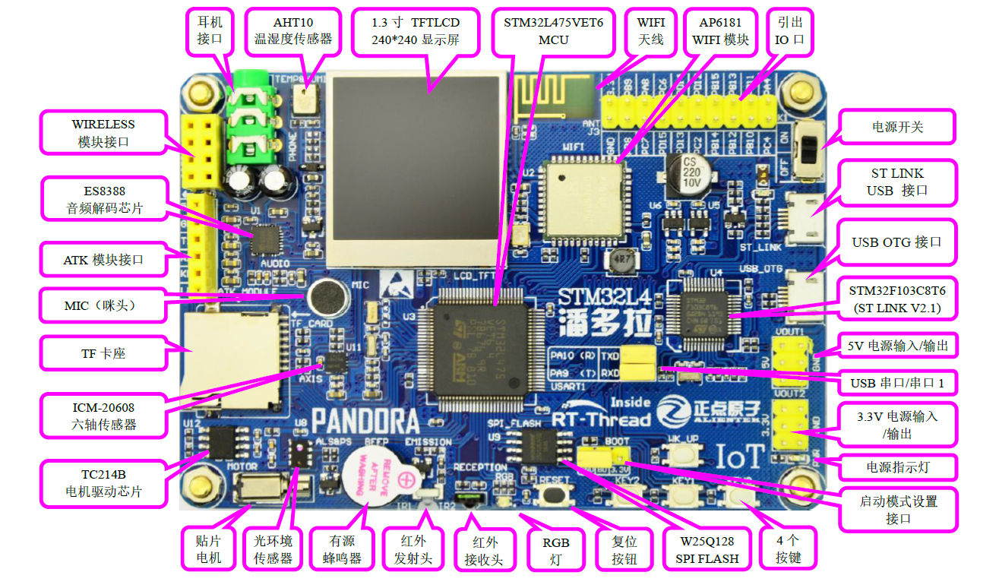

# PandoraBoard
潘多拉开发板是正点原子、 RT-Thread 联合推出的一款基于 ARM Cortex-M4 内核的开发板，芯片使用的是STM32L475，主频80MHZ。

ALIENTEK 潘多拉 STM32 开发板载资源如下：
- MCU：STM32L475VET6，LQFP100，SRAM：128K，FLASH：512K
- 外扩 SPI FLASH：W25Q128，16M 字节
- 1 个电源指示灯（蓝色）
- 1 个 RGB 状态指示灯（红、绿、蓝三色）
- 4 个功能按钮，其中 WK_UP 兼具唤醒功能
- 1 个启动模式配置选择接口
- 1 个复位按钮
- 1 个红外接收头，并配备一款小巧的红外遥控器
- 1 个红外发射头
- 1 个有源蜂鸣器
- 1 个光环境传感器：AP3216C
- 1 个贴片电机，带 TC214B 电机驱动芯片
- 1 个六轴传感器：ICM-20608
- 1 个 TF 卡座
- 1 个录音头（MIC/咪头）
- 1 个 ATK 模块接口，支持 ALIENTEK 蓝牙/GPS/MPU6050/RGB 灯等模块
- 1 个高性能音频解码芯片：ES8388
- 1 个无线模块接口（WIRELESS），支持 NRF24L01 无线模块/以太网模块
- 1 路立体声耳机接口
- 1 个温湿度传感器：AHT10
- 1 个 TFTLCD 显示屏：1.3 寸 240*240 分辨率
- 1 个 WIFI 天线
- 1 个 WIFI 模块：AP6181
- 1 个电源开关，控制整个板的电源
- 1 个 STM32F103C8T6，集成 ST LINK V2 功能，Version: V2J41M27，
- 1 个 ST LINK Micro USB 接口，可用于供电、程序下载、仿真调试和串口通讯
- 1 个 USB OTG Micro USB 接口，用于供电、USB Slave 和 USB Master
- 1 组 5V 电源供应/接入口
- 1 组 3.3V 电源供应/接入口
- 1 组 IO 口扩展接口，并带 3.3V 电源输出接口

# 工程目录结构
| 文件夹名称 | 备注 |
|---|---|
| Document  |  文档资料 |
|Inculde|头文件|
|Src|源文件|
|Makefile|makefile 文件|

